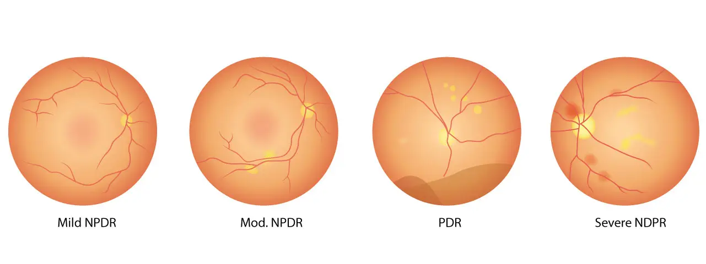

# Diabetic Retinopathy Detection 

## 1.About The Dataset
Millions of people suffer from diabetic retinopathy, the leading cause of blindness among working aged adults. Aravind Eye Hospital in India hopes to detect and prevent this disease among people living in rural areas where medical screening is difficult to conduct. Successful entries in this competition will improve the hospital’s ability to identify potential patients. Further, the solutions will be spread to other Ophthalmologists through the 4th Asia Pacific Tele-Ophthalmology Society (APTOS) Symposium

to read more about the dataset : [here](https://www.kaggle.com/competitions/aptos2019-blindness-detection/overview/description)

## 2.About The Model : 
I used CNN architecture and train the network with data Cross Validation to ensure getting all data

Model training Activity : 

